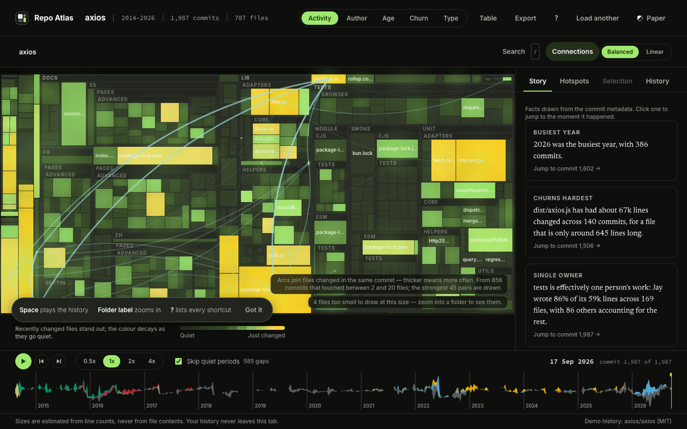
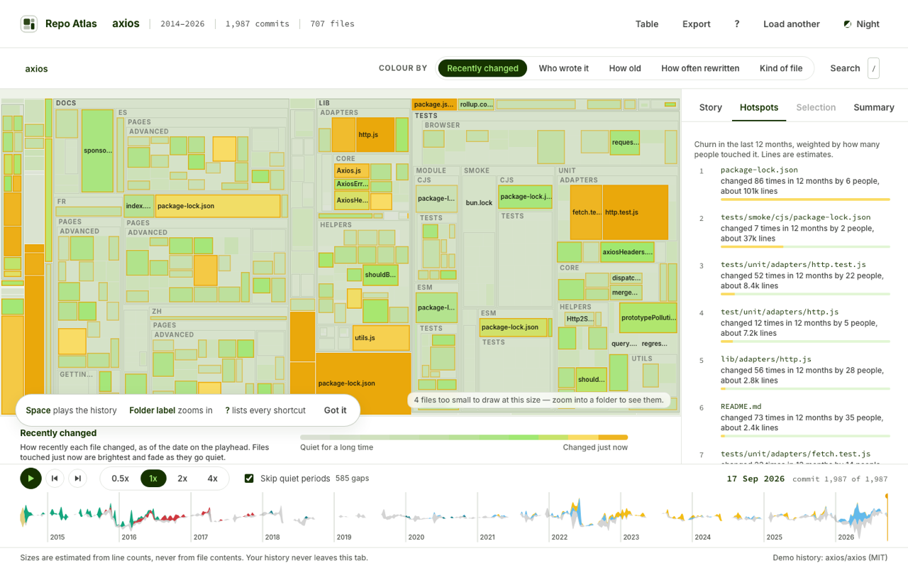
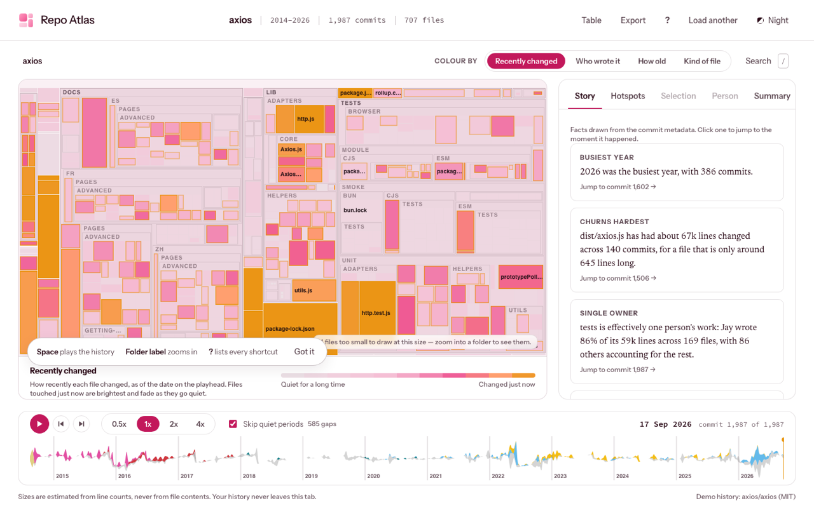

# Repo Atlas

**Repo Atlas turns the history of a software project into a map you can watch
grow.**

Every file in the project becomes a rectangle. Rectangles that belong to the
same folder sit together, like towns in a county. Then you press play, and the
whole history runs in front of you: files appear, swell, get renamed, move to
new folders and disappear, while a chart underneath shows who was working and
when.

Everything happens inside your browser tab. Nothing is uploaded anywhere.


---

## Table of contents

- [If you have never used git](#if-you-have-never-used-git)
- [What you can do with it](#what-you-can-do-with-it)
  - [The map](#1-the-map)
  - [Five ways to colour the map](#2-five-ways-to-colour-the-map)
  - [Looking at one file](#3-looking-at-one-file)
  - [Going into a folder](#4-going-into-a-folder)
  - [Playing the history](#5-playing-the-history)
  - [The chart at the bottom](#6-the-chart-at-the-bottom)
  - [Connections between files](#7-connections-between-files)
  - [Story](#8-story)
  - [Hotspots and single-owner folders](#9-hotspots-and-single-owner-folders)
  - [Search](#10-search)
  - [Themes, motion and readability](#11-themes-motion-and-readability)
- [Keyboard shortcuts](#keyboard-shortcuts)
- [Using it on your own project](#using-it-on-your-own-project)
- [Privacy](#privacy)
- [Honest numbers: what is estimated and why](#honest-numbers-what-is-estimated-and-why)
- [How it works inside](#how-it-works-inside)
- [Speed](#speed)
- [Running and testing it](#running-and-testing-it)
- [Where things live in the code](#where-things-live-in-the-code)
- [Decisions and limitations](#decisions-and-limitations)

---

## If you have never used git

You can skip this if you already know what a commit is.

Software is built by editing text files. Almost every software team uses a tool
called **git** to keep a record of those edits. The record works like a diary:

- A **repository** (or "repo") is one project — all of its files, plus its
  whole diary.
- A **commit** is one entry in the diary. It says *who* changed the project,
  *when*, a short sentence about *why* ("fix the login button"), and exactly
  which files were touched.
- For each file in a commit, git also records **how many lines were added and
  how many were removed**. Not the text itself — just the counts.
- A **branch merge** is when two people's parallel work is joined back together.

That is all Repo Atlas reads: the list of commits, who made them, when, their
one-line descriptions, and the line counts. It never sees a single line of
actual code.

From those ingredients you can learn a surprising amount: which parts of a
project are busy, which are abandoned, who knows which area, and what the
project looked like at any moment in its life.

---

## What you can do with it

### 1. The map

The main picture is a **treemap**. Imagine the whole screen is the project.
It gets divided into rectangles, one per file. A bigger rectangle means a
bigger file.

- Files in the same folder are drawn next to each other inside a bordered
  region, with the folder's name in small capitals along its top edge.
- Folders inside folders nest, so you can see the shape of the project at a
  glance — a large `docs` region, a dense `tests` region, and so on.
- **File size is an estimate**, worked out from how many lines have been added
  and removed over the file's life. Repo Atlas says so everywhere it shows a
  size. See [Honest numbers](#honest-numbers-what-is-estimated-and-why).

Two controls change how the rectangles are sized:

| Setting | What it does |
| --- | --- |
| **Balanced** (default) | Big files are still bigger, but the difference is softened, so small files stay visible. |
| **Linear** | Area is directly proportional to the estimated line count. One enormous generated file can swallow the picture. |

When a project has more files than there are pixels, the tiniest ones cannot be
drawn honestly. Rather than fake them, Repo Atlas merges them into their
folder's background and tells you in the corner: *"4,235 files too small to draw
at this size — zoom into a folder to see them."*

### 2. Five ways to colour the map

Press **1**–**5**, or use the buttons in the top bar. Each mode has a legend
explaining what the colours mean, because colour is never the only way the
information is available.

| Mode | What the colour shows | Reading it |
| --- | --- | --- |
| **1 Activity** (default) | How recently and how often a file changed | Dark = quiet for a long time. Green = recently touched. Yellow and amber = changed a lot, very recently. |
| **2 Author** | Who has added the most lines to each file | Ten colours for the ten biggest contributors, grey for everyone else. Bots are labelled "BOT" in the legend. |
| **3 Age** | When the file first appeared | Bright = new. Faded = present since early on. |
| **4 Churn** | Total lines added plus removed over the file's whole life | Pale = written once and left alone. Deep teal = rewritten again and again. |
| **5 Type** | What kind of file it is, from its name | Code, Tests, Docs, Config, Assets. |

Activity fades over time: a file that was edited constantly last year but not
since will cool off as you move the playhead forward. This is why the map
"breathes" during playback.

### 3. Looking at one file

**Hover** any rectangle and a small card follows your pointer with the file's
full path, its estimated size, how many commits touched it, when it was last
touched, and a tiny graph of how it grew.

**Click** a rectangle to select it. The **Selection** panel on the right then
shows:

- the folder path (each part is a button that zooms the map into that folder),
- the file's name and its kind (Code, Tests, …),
- estimated size, number of commits, when it was created and last touched,
- who created it,
- **a graph of its size across its whole life**, with a marker showing where the
  playhead currently sits,
- **who wrote it** — every contributor, as bars, by lines added,
- **the five biggest commits** that touched it; click one to jump the playhead
  to that moment,
- a **"single owner"** badge if effectively one person wrote its folder.

### 4. Going into a folder

Projects are too big to read at once, so you can zoom in.

- **Click a folder's name label** on the map to fly into it. The map re-draws
  using only that folder's files, so they get the whole screen.
- A **breadcrumb** appears above the map (`axios / lib`). Click any part of it
  to come back out.
- Or use the folder path in the Selection panel, which does the same thing and
  works with the keyboard.
- **Esc** steps back out.

There is deliberately no free-form panning or wheel zooming. You are always
somewhere nameable, and you can always get back.

### 5. Playing the history

The controls at the bottom left run the history like a film.

| Control | What it does |
| --- | --- |
| **Play / Pause** | Runs the history forward. At 1× the entire project history takes about 45 seconds, whether it covers one year or twenty. |
| **Step back / forward** | Moves exactly one commit at a time. |
| **0.5× / 1× / 2× / 4×** | Playback speed. |
| **Skip quiet periods** | On by default. Long stretches with no commits are compressed, so you are not left staring at a frozen map during a three-month holiday. The label tells you how many such gaps exist. |

While it plays, the map animates rather than jumping:

- a **new file** grows into place with a brief flash,
- a file that is **deleted** shrinks and fades to an empty outline,
- a file that is **renamed or moved to another folder** slides across to its new
  home instead of vanishing and reappearing.

A **ticker** in the bottom-left corner of the map fades commit messages in and
out as they happen, with a coloured dot for the author. At high speed it samples
at most eight a second, because faster than that is unreadable anyway.

### 6. The chart at the bottom

The flowing coloured ribbon along the bottom is a **streamgraph**. Left to right
is time, from the project's first commit to its last. The thickness of the band
at any point is how many commits happened that week. Each colour is one of the
seven busiest people, with everyone else pooled into a grey band.

It is also the **scrubber**:

- **Click** anywhere on it to jump to that moment.
- **Drag** to scrub through history; the map follows continuously.
- **Hover** to read the date and the number of commits that week.
- Year markers run along the bottom.

The shape tells its own story: you can see when a project was a solo effort,
when a team arrived, when someone left, and when everything went quiet.

### 7. Connections between files



Click **Connections** (or press **c**) to draw arcs between files that tend to
be changed *in the same commit*. If two files always get edited together, they
are coupled in practice, whatever the folder structure says.

- With a file selected, only that file's connections are drawn.
- With nothing selected, the strongest connections in the whole project are
  drawn.
- Thicker and brighter arcs mean the pair changed together more often.

A caption states exactly what was counted, for example: *"From 856 commits that
touched between 2 and 20 files; the strongest 45 pairs are drawn."* Commits that
touch more than 20 files are deliberately ignored — a sweeping rename relates
everything to everything and would tell you nothing.

### 8. Story

The **Story** tab writes six to nine plain-English sentences about the project,
each one a card you can click to jump to the moment it describes. For the
bundled demo they read like this:

> **Busiest year** — 2026 was the busiest year, with 386 commits.
>
> **Longest quiet spell** — Nothing was committed for 139 days, between
> 17 Sep 2018 and 4 Feb 2019.
>
> **Single owner** — tests is effectively one person's work: Jay wrote 86% of
> its 59k lines across 169 files, with 86 others accounting for the rest.

The facts cover: the busiest year, the file that churns hardest for its size, a
folder with a single owner, the largest single commit, the longest silence, who
owns the biggest folder, the largest the project ever was, the very first
commit, and the busiest single week.

These are generated from the data, not written by hand, and every sentence
states the measurement behind it. See
[the accuracy check](#the-demos-story-cards-checked-by-hand).

### 9. Hotspots and single-owner folders



The **Hotspots** tab ranks the files that have been changed most in the recent
past — the last quarter of the project's life, or the last twelve months,
whichever is shorter.

Each entry explains itself in words, for example: *"changed 52 times in 12
months by 22 people, about 8.4k lines"*. Files that many people keep changing
are usually where the difficulty lives.

Below that is a list of **single-owner folders**. A folder is single-owner when
one person wrote 80% of the lines ever added to it — the "bus factor", as in
*how many people would have to be hit by a bus before the knowledge is gone*. A
bus factor of 1 is a risk worth knowing about. Bots are not counted as people.

### 10. Search

Press **/** and type part of a path. Matching is fuzzy, so `adhttp` finds
`lib/adapters/http.js`. Matching files stay bright and everything else on the
map dims, so you keep the shape of the project while you look. Press **Enter**
to select the best match, **Esc** to close.

### 11. Themes, motion and readability



- **Night** (default) and **Paper** themes, switchable in the top bar and
  remembered for next time.
- If your system is set to **reduce motion**, the animations are replaced with
  simple crossfades, the landing page's background stops moving, and playback
  jumps rather than sliding.
- Text contrast is checked automatically against the accessibility standard of
  4.5:1 in both themes, by a test that runs with the rest of the suite.
- The map itself carries a written description for screen readers.

---

## Keyboard shortcuts

| Key | Action |
| --- | --- |
| **Space** | Play or pause |
| **←** / **→** | Step one commit back or forward |
| **Shift + ←** / **→** | Jump ten commits |
| **Home** / **End** | Go to the first or last commit |
| **[** / **]** | Slower or faster |
| **1**–**5** | Colour the map by Activity, Author, Age, Churn, Type |
| **c** | Show or hide the connection arcs |
| **/** | Search for a file |
| **Esc** | Clear the selection, then zoom out of a folder |

Every control is also reachable with **Tab**, and gets a visible focus ring.

---

## Using it on your own project

Repo Atlas never reads your project directly. You produce one text file from
your own machine and drop it in.

**Step 1.** Open a terminal in your project's folder and run:

```bash
git -c core.quotepath=false log --reverse --no-merges -M --numstat \
  --format='@@@%n%H%n%an%n%ae%n%aI%n%s' > atlas.txt
```

**Step 2.** Drop the resulting `atlas.txt` onto the Repo Atlas landing page, or
paste its contents, or pick it with the file chooser. A `.gz` compressed file
works too.

You do not have to understand the command, but here is what each part does:

| Part | Meaning |
| --- | --- |
| `log` | Print the project's diary. |
| `--reverse` | Oldest entry first, so the story runs forwards. |
| `--no-merges` | Skip the bookkeeping entries that only join two lines of work. |
| `-M` | Detect renames, so a file that moves keeps its identity instead of looking like a deletion plus a new file. |
| `--numstat` | Add the "lines added / lines removed" counts per file. |
| `--format=…` | Print who, when and the one-line description, separated by `@@@` markers. |
| `-c core.quotepath=false` | Keep non-English filenames readable. |
| `> atlas.txt` | Save it to a file instead of printing it. |

The landing page shows this command with a copy button, and a second version
that prints to the terminal instead of saving a file.

**If you just want to look around**, press **Try the demo**. It loads the real
history of [axios](https://github.com/axios/axios), an MIT-licensed open-source
project with 1,987 commits between 2014 and 2026.

---

## Privacy

This is the part worth being precise about.

- Repo Atlas is a **static web page**. There is no server, no account, no
  database and no analytics.
- Your history file is read **inside your browser tab**. It is never uploaded.
- After the page has loaded, the app makes **no third-party network requests of
  any kind**. The only requests it makes are for its own files, from the same
  address it was loaded from: fonts, code, and the demo history if you ask for
  it.
- This is enforced by an automated test that fails the build if any request
  goes anywhere else.
- The only thing stored on your machine is your Night/Paper preference.
- Because the input is only commit metadata and line counts, **Repo Atlas never
  sees your source code at all** — not even if you wanted it to.

---

## Honest numbers: what is estimated and why

git's `--numstat` gives line counts, not file sizes. So:

- **Every file size is an estimate.** It starts at the number of lines the
  file's first commit added, then adds and subtracts as later commits add and
  remove lines. It never goes below zero. Anywhere the interface shows a size it
  says "estimated" or shows a `~`.
- **Binary files** — images, fonts, compiled artefacts — have no line counts at
  all. git just prints `-`. They are given a constant weight of 30 so they still
  appear on the map, and they are marked as Assets.
- **A deleted binary file cannot be detected.** Because a binary change carries
  no counts, removing one looks exactly like editing one. Those files stay on
  the map.
- **Deletions that only happen inside a merge are invisible**, because the
  recommended command skips merges.

How wrong does that make it? It is measured rather than guessed. For the
bundled axios demo, at the latest commit:

- every one of the 473 files git actually reports is present on the map,
- **7 extra** files are shown that git no longer has — one deleted binary, and
  six whose deletion only exists inside a merge,
- an overshoot of about **1.5%**.

That check runs as a test (`src/worker/demo.test.ts`), so a real regression
would be caught rather than quietly accepted.

### The demo's story cards, checked by hand

Each was verified against the axios repository directly:

| Card | Repo Atlas | git |
| --- | --- | --- |
| Busiest year | 2026, 386 commits | 386 |
| First commit | 18 Aug 2014, Matt Zabriskie, "first commit" | same |
| Largest commit | ~52k lines, "refactor: bump minors package versions (#7356)" | 51,771 lines, same commit |
| Longest quiet spell | 139 days, 17 Sep 2018 to 4 Feb 2019 | same |
| Busiest week | 29 commits, week of 2 Jun 2022 | same |

Two of these needed care:

- **The longest gap is 139 days, not the 165 that git's default ordering
  suggests.** Thirteen axios commits carry a timestamp earlier than the commit
  before them — normal after a rebase, where history is replayed onto a new
  base. Sorting the dates gives 139 days, which is what a person checking by
  hand would find.
- **The busiest week excludes bots**, exactly as the streamgraph does: 29 rather
  than the 33 you get by counting automated dependency updates. The sentence
  says so.

---

## How it works inside

### The shape of the program

```
   your browser tab
   ┌──────────────────────────────────────────────────────────────┐
   │  MAIN THREAD                        │  WEB WORKER            │
   │  ─────────────                      │  ──────────            │
   │  React: chrome, panels, buttons     │  streaming parser      │
   │  Canvas renderer: the map           │  the data model        │
   │  Canvas renderer: the streamgraph   │  checkpoint index      │
   │  pointer, keyboard, playback clock  │  treemap layout        │
   │                                     │  hotspots, ownership,  │
   │        ── messages ──▶              │  story facts, search   │
   │        ◀── typed arrays ──          │                        │
   └──────────────────────────────────────────────────────────────┘
```

A **web worker** is a second thread. Everything slow happens there, so the
interface never freezes: you can keep scrolling and clicking while a 47 MB
history is being read.

The two sides exchange messages. Geometry comes back as **transferable typed
arrays** — blocks of raw numbers whose ownership moves between threads without
being copied.

### Reading the file

`src/worker/parse.ts`

The file is read as a **stream**: a chunk at a time, decoded, and fed to a small
state machine. A 100 MB file is never held in memory as one string, and progress
("Read 48,213 commits, 12,904 files") can be reported as it goes.

Each commit is exactly six lines — a `@@@` marker, then hash, author name,
email, date, description — and the parser counts positions rather than splitting
on a separator. That matters because a commit description can contain anything,
including tabs, quote marks, and the literal text `@@@`.

Chunks do not arrive on tidy line boundaries, so the last partial line is held
back and joined to the front of the next chunk. Tests feed the same fixture in
chunks of 1, 2, 3, 7, 64 and 997 bytes and require identical results.

**Renames** are the fiddly part. git writes them in five different shapes, all
confirmed against real git output:

```
src/core/{engine.js => runner.js}      a rename inside a folder
{src/core => lib/kernel}/runner.js     a folder that moved
pkg/{ => sub}/thing.txt                a file that moved into a folder
pkg/{sub => }/thing.txt                a file that moved out of one
sub/a.txt => a.txt                     no shared prefix at all
```

`src/worker/paths.ts` reconstructs the old and new path for each. The file keeps
its identity across the rename, which is what lets the map *slide* a file to its
new home instead of killing one rectangle and birthing another.

If the file ever looks wrong, the error names the line number, prints the
offending text, and suggests a fix.

### Storing the history

`src/worker/model.ts`

A 100,000-commit project contains roughly 916,000 individual file changes.
One JavaScript object per change would cost more memory than the entire budget,
so the history is stored **columnar**: one long array per field.

```
commit:        0        1        2        3     …
time:      [ 1.6e12, 1.6e12, 1.6e12, 1.6e12, … ]   when
author:    [      0,      3,      0,      7, … ]   who
offsets:   [      0,      3,      5,      9, … ]   where its changes start
                    ╲       ╲
files:     [ 12, 40, 7,   3, 9,   … ]              which file
adds:      [ 10,  4, 0,  22, 1,   … ]              lines added
```

The `offsets` array is the trick: commit 1's changes are everything between
positions 3 and 5 in the lower arrays. This layout is called **compressed sparse
row**, and it means walking the whole history is a straight march through memory
rather than chasing pointers.

People are identified by lower-cased email address, so `Ada@Example.com` and
`ada@example.com` are one person; the display name is whichever spelling they
used most. Accounts matching `[bot]`, `dependabot`, `renovate` or
`github-actions` are flagged as bots.

### Showing any moment instantly

`src/worker/state.ts`

To draw the map at commit 40,000, you need to know every file's size and
location at that exact moment — which normally means replaying 40,000 commits.
That is far too slow to do while dragging a scrubber.

So the worker takes **checkpoints**: a complete snapshot of every file's state,
saved periodically while indexing. To reach any commit it restores the nearest
earlier snapshot and replays only the handful of commits after it.

The brief called for a snapshot every 256 commits. On the largest test project
that would be 391 snapshots of 420 KB each — about 230 MB, blowing the memory
budget on its own. So the interval widens until the index fits in 48 MB: 1,024
commits on the big test project, still 256 on the demo. Worst case, a scrub
replays about 9,400 file changes, which is well inside a single frame.

A test proves this is not a shortcut: at forty randomly chosen commits, the
checkpoint-restored state is compared field by field against a full replay from
the beginning, and must match exactly.

### "How hot is this file?"

Activity is modelled as heat that decays. Each time a file is touched:

```
heat = (previous heat, decayed since it was last touched) + 1
```

and when drawing, the heat is decayed again from the last touch up to the moment
on screen. The decay constant is 5% of the project's total lifetime, with a
floor of seven days so that a project one day old does not divide by nearly
zero. The effect is that busy files glow and then cool, at a rate that suits the
project's own pace.

### Arranging the rectangles

`src/worker/layout.ts`

The layout uses a **squarified treemap**, which subdivides a rectangle so the
pieces stay close to square and therefore readable.

Two decisions matter:

- **Siblings are ordered by name, never by size.** Sorting by size looks tidier
  in a still image, but during playback every rectangle would leap across the
  screen whenever a neighbour grew. Fixed order means the map is *stable*, and
  movement always means something real happened.
- **Area uses size^0.6 by default.** Raw line counts let one machine-generated
  file swallow the picture. The exponent compresses the extremes while keeping
  the ordering truthful. "Linear" turns it off.

Folders get 1 pixel between cells, 2 pixels of margin, and a 15-pixel strip
along the top for the folder's name — but only when the folder is big enough for
the name to fit.

### Drawing

`src/map/render.ts`, `src/map/MapController.ts`

The map is drawn on **two stacked canvases**: a base layer for the cells and
folder borders, and an overlay for hover, selection, glows and arcs. Hovering
only repaints the small overlay.

In the drawing loop there are no memory allocations at all. Colours are resolved
through **lookup tables** — 64 pre-computed shades per ramp, rebuilt only when
the theme changes — so colouring a cell is an array read. The glow around hot
files is a **pre-rendered sprite** drawn with additive blending, rather than the
canvas blur feature, which is far too slow at this scale.

Cells smaller than 0.75 pixels are skipped and their folder's background shows
through instead, which is why the "too small to draw" note exists.

**Readable labels.** A file's label sits directly on its cell, and that cell's
colour is data — it could be near-black or bright yellow. A single grey cannot
work on both. Each cell therefore chooses dark or light ink based on its own
brightness, and a test checks both inks against all 27 possible cell colours in
both themes.

**Hit testing** uses a grid of buckets, so finding what is under the pointer
checks a handful of rectangles rather than 20,000. It also allows a three-pixel
tolerance, because the one-pixel gaps between cells would otherwise leave dead
seams criss-crossing the map.

### Making time move

`src/map/clock.ts`

Playback position, speed and current commit live in a **plain mutable object**,
not in React state. The animation loop reads it directly sixty times a second.
React subscribes separately and is notified about eleven times a second — plenty
for a date readout, far too slow to drive a map.

The loop **stops completely** when nothing is moving, so an idle map costs no
battery.

**Skipping quiet periods** works by building two timelines when the history is
indexed: one in real time, and one where any gap longer than a cap counts only
as the cap. The cap is twelve times the project's typical gap between commits,
clamped between an hour and three days. Moving the playhead is a binary search
into whichever timeline is active.

**Animating between two moments.** The layout for a new commit arrives from the
worker as a fresh set of rectangles. The main thread matches the two sets by
file identity and animates between them: files in both slide and resize, files
only in the new one grow in, files only in the old one collapse to an outline.
One layout request is in flight at a time, so the worker never builds a backlog,
and the animation's duration adapts to how fast layouts are actually arriving.

### The streamgraph

`src/components/Streamgraph.tsx`

Commits are counted per week per author, then stacked with d3's "wiggle" offset,
which minimises how much the bands slope and gives the shape its flowing look.

Wiggle has a catch: its baseline wanders. Over the demo's 632 weeks it drifted
224 units while the ribbon was only 29 thick, so fitting the whole range left a
hairline on an empty canvas. The fix is to subtract a heavily smoothed centre
line from each column, which removes the long-range drift and keeps the local
wiggle. This is the difference between the chart being useless and being the
best summary on the screen.

### Files that change together

`src/worker/cochange.ts`

For each commit, every pair of files it touched gets a point. Two limits keep
this honest and affordable: commits touching more than 20 files are skipped
(quadratic cost, no meaning), and only the 600 busiest files are considered.
The strongest pairs are drawn as curved arcs.

### Hotspots, ownership and the story

`src/worker/meaning.ts`

- **Hotspot score** = churn in the recent window × log(1 + number of distinct
  people in that window). Both ingredients matter: lines alone favours generated
  files, people alone favours trivia.
- **Bus factor** of a folder = the smallest number of non-bot people whose
  combined line contributions reach 80% of that folder's total. Lines are
  attributed to every folder above a file, so `src`, `src/core` and
  `src/core/internal` each get their own figure.
- **Story facts** are template sentences filled from measured values, each with
  a commit to jump to. They are recomputed when the playhead settles, never
  while it is moving.

The whole meaning pass costs about 200 ms on a 100,000-commit history.

### Search

Fuzzy matching: every character of the query must appear in order. Runs of
adjacent matches score higher, and a match inside the file's name beats one
buried in a directory. It runs in the worker against the files that exist at the
current moment in the history.

---


## Where things live in the code

```
src/
  worker/          everything that runs off the main thread
    parse.ts         streaming reader for the git log format
    paths.ts         the five rename shapes
    model.ts         columnar storage of the history
    state.ts         file state at a commit, and the checkpoint index
    fileIndex.ts     per-file lookups, dominant author, file kinds
    layout.ts        the treemap
    timeline.ts      weekly bins and the two playback timelines
    cochange.ts      files that change together
    meaning.ts       hotspots, ownership, story facts, search
    atlas.worker.ts  the message handler tying those together
  map/             the map's rendering and interaction (no React)
    render.ts        canvas drawing
    MapController.ts canvases, frame loop, pointer, transitions
    colors.ts        colour ramps, lookup tables, label inks
    hit.ts           what is under the pointer
    clock.ts         playback position and speed
  components/      React: panels, dock, tooltip, search, ticker
  screens/         landing, loading, main
  store/           small state containers (zustand)
  styles/          design tokens and stylesheets
scripts/           the synthetic history generator
e2e/               browser tests and screenshots
```

**Built with** Vite, React, TypeScript in strict mode, a handful of d3 modules
(`d3-hierarchy`, `d3-scale`, `d3-shape`, `d3-array`, `d3-interpolate`,
`d3-ease`), framer-motion for interface polish only — never for the map — and
zustand for state. Fonts are self-hosted: Inter for the interface, Source Code
Pro for paths and numbers, Newsreader for the story sentences.

---

## Decisions and limitations

**Not built yet** (the remaining milestone): exporting the map as an image or a
video of the playback, a plain HTML table view of the same information for
people who cannot use the canvas, and an in-app help sheet.

**Known limitations**, all consequences of using only commit metadata:

- File sizes are estimates, not measurements.
- Deleted binary files, and deletions that happen only inside a merge, stay on
  the map — about 1.5% overshoot on the demo.
- One person using two email addresses appears as two people.
- The map is designed for a desktop-sized screen; below 900 pixels wide it falls
  back to a simplified stacked layout.


---

## Licence and credits

The demo dataset is the commit history of
[axios/axios](https://github.com/axios/axios), used under the MIT licence, and
credited in the application footer.
